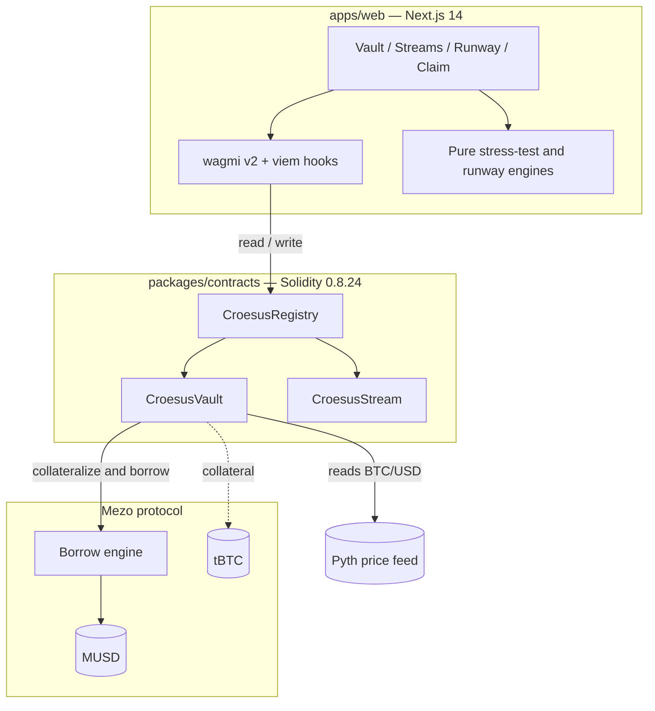

<div align="center">

# Croesus

### Bitcoin, unlocked.

A non-custodial Bitcoin treasury operating system built on [Mezo](https://mezo.org).
Collateralize BTC, borrow MUSD at a fixed 1% rate, and stream payroll by the second —
without selling a single sat.

[](./LICENSE)
[](https://soliditylang.org)
[](https://nextjs.org)
[](https://getfoundry.sh)
[](https://pnpm.io)

</div>

---

## Why Croesus

Traditional treasury software assumes fiat is the unit of account. DeFi treasury tools
assume Ethereum. Neither treats **Bitcoin as the primary reserve asset** while giving a
finance team real operational tooling on top of it.

Selling BTC to make payroll means giving up the upside and, often, triggering a taxable
event. Croesus removes that trade-off. It sits one layer above Mezo's BTC-collateralized
borrowing primitive and turns it into an organizational finance layer that a CFO with no
DeFi background can operate without friction:

- **Keep the Bitcoin.** Collateral stays yours — non-custodial, never sold.
- **Spend at 1% fixed.** Draw MUSD against BTC at Mezo's fixed rate. No floating APR.
- **Pay continuously.** Stream MUSD to contributors per second; they claim anytime.
- **See the cliff before it arrives.** Model a BTC crash with a single slider and watch
  runway, collateral ratio, and liquidation price update live.

## The three modules

| Module | Responsibility |
|---|---|
| **CroesusVault** | Collateral management and MUSD borrowing. Deposit tBTC, borrow, repay, withdraw. Enforces a conservative 150% margin-call ratio, well above Mezo's ~110% liquidation threshold. |
| **CroesusStream** | Real-time, per-second MUSD payroll. Funded from already-borrowed MUSD (transfers, never mints). Pause, resume, cancel, and one-click claim. |
| **Croesus Runway** | Treasury-health and liquidation simulation. A pure, synchronous stress-test engine projects runway and the liquidation price across BTC drawdowns down to -80%. |

## Architecture



The contracts are built **mocks-first**: a mock Mezo stack (MUSD, tBTC, Borrow, Pyth)
lets the entire product run end-to-end on a local chain today, and the mock addresses
are swapped for real Mezo testnet addresses once the integration surface is confirmed.

## Tech stack

| Layer | Choices |
|---|---|
| Monorepo | Turborepo, pnpm workspaces |
| Contracts | Solidity `^0.8.24`, Foundry (Forge, Anvil, Cast), OpenZeppelin |
| Frontend | Next.js 14 (App Router), TypeScript 5, Tailwind CSS 3 |
| Web3 | wagmi v2, viem v2, RainbowKit |
| Oracle | Pyth Network (BTC/USD) |
| State | Zustand |
| Networks | Mezo Testnet (`31611`), local Anvil (`31337`) |

## Repository layout

```
.
├── apps/
│   └── web/                  Next.js 14 frontend
│       ├── app/              Routes: landing, /app, /app/vault, /app/streams, /claim, /onboarding
│       ├── components/       ui, vault, streams, runway, layout, wallet
│       ├── hooks/            useVault, useStreams, useOrg, useTxRunner, useTicker, ...
│       ├── lib/              wagmi, chains, runway, stressTest, vaultMath, utils
│       └── abis/             Contract ABIs exported from Foundry
├── packages/
│   └── contracts/            Foundry / Solidity workspace
│       ├── src/              CroesusVault, CroesusStream, CroesusRegistry, mocks/
│       ├── test/             Foundry test suites
│       └── script/           Deploy.s.sol
├── package.json              Turborepo root
├── pnpm-workspace.yaml
└── turbo.json
```

## Getting started

### Prerequisites

- **Node.js** >= 18
- **pnpm** 11 (`corepack enable`)
- **Foundry** — install with `curl -L https://foundry.paradigm.xyz | bash && foundryup`

### Install

```bash
pnpm install
```

### Run the full stack locally

The app runs against a local chain with the mock Mezo stack. Use two terminals.

**Terminal A — local chain:**

```bash
anvil
```

**Terminal B — deploy, export ABIs, and start the web app:**

```bash
# Deploy the mock stack + CroesusRegistry to the local chain
pnpm --filter @croesus/contracts deploy:local

# Export fresh ABIs to apps/web/abis
pnpm --filter @croesus/contracts abi:export

# Start the frontend
pnpm --filter @croesus/web dev
```

Open <http://localhost:3000>. Connect a wallet pointed at the Anvil network
(chain id `31337`, RPC `http://127.0.0.1:8545`) and import Anvil's first prefunded
account — the deploy script seeds it with test tBTC so you can open a vault immediately.

> The treasury pages under `/app` require a connected wallet by design. The landing page
> and the salary-claim page are public.

### Configuration

Copy the example environment file and adjust as needed. The web app reads
`apps/web/.env.local`:

```bash
cp .env.example apps/web/.env.local
```

The local deploy is deterministic, so the default mock addresses in the example file match
a fresh `anvil` + deploy. Point `NEXT_PUBLIC_CHAIN_ID` at `31611` to target Mezo Testnet.

## Testing

```bash
# Solidity unit tests (Foundry)
pnpm --filter @croesus/contracts test

# Frontend engine unit tests (Vitest) — runway, stress test, vault math, streams
pnpm --filter @croesus/web test

# End-to-end flows (Playwright)
pnpm --filter @croesus/web e2e
```

The financial engines (runway, stress test, vault math) are pure and synchronous, and are
covered by fast unit tests independent of any chain.

## Project status

| Area | State |
|---|---|
| Smart contracts (Vault, Stream, Registry, mocks) | Complete, fully unit-tested |
| Frontend modules (Vault, Streams, Runway, Claim) | Complete |
| Stress-test slider and runway dashboard | Complete |
| UI/UX polish pass | In progress |
| Real Mezo integration | Pending confirmation of the live integration surface |

## Security and disclaimers

This software is built for a hackathon and runs against mock contracts and a testnet.
It is **not audited** and is **not production software**. Do not use it with real funds.
Borrowing against BTC collateral carries liquidation risk; on-chain BTC custody depends on
the tBTC bridge. Nothing here is financial or tax advice.

## Contributing

Contributions are welcome. Please open an issue to discuss substantial changes first.
Run `pnpm lint` and the relevant test suites before submitting a pull request, and keep
changes consistent with the existing structure and the contract invariants.

## License

Released under the [MIT License](./LICENSE).

## Acknowledgements

Built on [Mezo](https://mezo.org) for the *Bank on Bitcoin* track. Price data from
[Pyth Network](https://pyth.network). Contracts developed with [Foundry](https://getfoundry.sh)
and [OpenZeppelin](https://openzeppelin.com); wallet UX powered by
[RainbowKit](https://rainbowkit.com).
